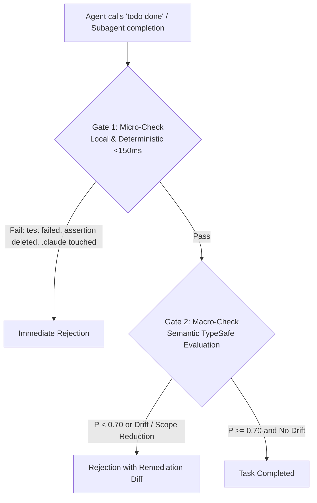

# OMP TypeSafe Planner Extension (`omp_extension`)

An advanced quality, security, and verification extension for [oh-my-pi (omp)](https://github.com/can1357/oh-my-pi) coding agents, powered by **TypeSafe System One** (`jev-latest`) structured probability judgments.

---

## 🌟 Key Features & Architecture



### 1. Dual-Cadence Verification Gate
* **Gate 1 (Local Deterministic Micro-Check, <150ms, 0 tokens):**
  * Checks working tree status, Git porcelain state, and test exit codes (`0`).
  * Catches test assertion deletions (anti-gaming defense).
  * Claude Boundary Isolation: Rejects any attempt to touch or modify files under `~/.claude` or `.claude.json`.
* **Gate 2 (Semantic Macro-Check via TypeSafe System One):**
  * Collects ground-truth OS evidence (`TaskEvidenceCollector`: git diff, status, test logs).
  * Evaluates `meets_criteria` (Noul: $P \ge 0.70$).
  * Detects `architectural_drift` (`no_drift`, `unapproved_deviation`, `scope_creep`, `other`).
  * Evaluates `scope_mode` (`HOLD`, `EXPANSION`, `REDUCTION`). Unauthorized `REDUCTION` is strictly rejected.

### 2. Tri-Role Expert Evaluators (`typesafe_expert_review`)
On-demand expert evaluation tool exposed to the agent:
* **`scope_arbiter`:** Evaluates plan and prompt adherence; blocks requirement dropping.
* **`drift_guard`:** Inspects unified diffs for unapproved cross-boundary changes.
* **`risk_security_triage`:** Calibrated scoring (0 to 3) on security invariants, credentials, and technical trade-offs.

### 3. File & Code Integrity Shield
* Intercepts `write` and `edit` tool calls targeting protected TypeSafe infrastructure files (`typesafe-planner.ts`, `models.yml`, and shared kit modules).
* Requires explicit operator override (`allowJudgeModification: true`) to prevent accidental or adversarial self-modification.

### 4. Dynamic Auth Recovery & Health Watchdog
* Token-hash-aware self-healing: automatically recovers from temporary 401s when `TYPESAFE_API_KEY` is rotated, without requiring an OMP process restart.
* Pre-flight session health probe on `session_start` with proactive visibility into judge availability.

### 5. Human Decision Interception
* Intercepts the `ask` tool automatically to evaluate proposed decisions and attach risk/clarity scorecards directly to what the human sees (high risk increases human oversight, never blocks it).

---

## 🚀 Setup & Usage

### 1. Prerequisites
* [Bun](https://bun.sh) runtime ($\ge 1.0$)
* TypeSafe API Key set in environment:
  ```bash
  export TYPESAFE_API_KEY="your-typesafe-key"
  ```
* Workspace enabled in `~/.claude/.ck.json`:
  ```json
  {
    "typesafe": {
      "projects": ["*"]
    }
  }
  ```

### 2. Link to OMP
In your OMP extensions folder (`~/.omp/agent/extensions/typesafe-planner.ts`), proxy to this repository:

```typescript
export { default } from "/path/to/Projects/omp_extension/typesafe-planner.ts";
```

### 3. Running Tests
The extension includes a 100% deterministic test suite covering unit tests, adversarial security attacks, and E2E interception:

```bash
bun test
```

### 4. Evidence-Gated Completion (EGC) Extension Setup
The workspace provides a standalone Evidence-Gated Completion extension (`src/egc.ts`) for strict deterministic task verification:

1. **Initialize Contract**:
   Run the `/egc init` command in your OMP agent session to generate a `.omp/egc.json` template in the workspace:
   ```bash
   /egc init
   ```
2. **Edit Contract**:
   Configure verification commands, required tasks, and holdout suites in `.omp/egc.json`. Contract creation should be done by the user or planning model, not the executor agent.
3. **User Approval & Lock**:
   Before the agent can be bound by EGC, the user must review and approve the contract:
   ```bash
   /egc lock
   ```
   Alternatively, set the environment variable `EGC_TRUST_CONTRACT=1` for automated CI/CD environments.
4. **Run with OMP**:
   ```bash
   omp --extension ./src/egc.ts
   ```
5. **Commands**:
   - `/egc status`: View task ledger, verification evidence, and completion status.
   - `/egc lint`: Validate the active contract rules against lint checks.
   - `/egc lock`: Pin and approve the current contract SHA.
   - `/egc approve <id>` / `/egc reset <id>`: Human override to approve or reset a specific task.
   - `/egc selftest`: Test TypeSafe semantic judgment connectivity.

---

## 📁 Repository Structure

```text
.
├── src/
│   ├── cook-expert-judge.ts     # Tri-role evaluators & Dual-cadence verification engine
│   ├── evidence-collector.ts    # Deterministic OS state collection & Claude isolation
│   ├── payload-safety.ts        # Egress redaction & payload bound enforcement (<=32KB)
│   ├── plan-evaluator.ts        # Plan-time quality elevation engine
│   ├── verification-gate.ts     # Micro/Macro gate execution
│   └── egc.ts                   # Evidence-Gated Completion (EGC) standalone extension
├── tests/                       # Comprehensive test suites (18 suites, 123+ tests)
├── plans/                       # Architectural execution blueprints & compliance specs
├── docs/journals/               # Historical ADRs & technical change logs
├── typesafe-planner.ts          # Core OMP Extension entrypoint & hook bridge
└── README.md
```

---

## 📄 License

MIT
