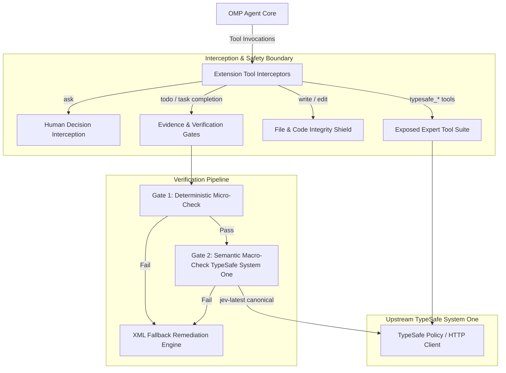

# System Architecture Document (SAD) — OMP TypeSafe Extension

## 1. Executive Summary & Architecture Overview
The **OMP TypeSafe Extension** (`omp-typesafe-extension`) is an architectural quality, security, and verification layer designed for [oh-my-pi (omp)](https://github.com/can1357/oh-my-pi) autonomous coding agents. Powered by **TypeSafe System One** structured probability judgments (`jev-latest`), it intercepts agent tool executions to eliminate hallucinations, enforce task completion integrity, protect project infrastructure, and validate human decision-making.



---

## 2. Core Architectural Pillars

### 2.1 Dual-Cadence Verification Pipeline
To guarantee performance and minimize token expenditure:
- **Gate 1 (Local Deterministic Micro-Check):**
  - **Latency:** $<150\text{ms}$, $0$ inference tokens.
  - **Verification:** Evaluates ground-truth operating system telemetry collected by `src/evidence-collector.ts` (git diff presence, exit code zero from test commands, unstaged/staged git changes, absence of stripped assertions or commented-out tests).
- **Gate 2 (Semantic Macro-Check via TypeSafe System One):**
  - **Model:** `jev-latest` (canonical upstream System One).
  - **Evaluation:** Gathers criteria from the plan/contract, formats payload defensively, and submits structured evaluation queries (`meets_criteria`, `claude_account_untouched`).

### 2.2 Tri-Role Expert Evaluators
Exposes specialized verification roles on-demand:
1. **`scope_arbiter`**: Analyzes the original user prompt versus planned tasks to detect and block unapproved scope reduction.
2. **`drift_guard`**: Analyzes git diffs against acceptance criteria to identify architectural deviation or creeping changes.
3. **`risk_security_triage`**: Rates security trade-offs (scale 0..3) across credential handling, dependency integrity, and prompt safety.

### 2.3 File & Code Integrity Shield
Protects the agent host environment and foundational TypeSafe infrastructure from self-modification or tampering:
- Intercepts `write` and `edit` operations.
- Enforces an immutable guardrail over: `typesafe-planner.ts`, `src/debate-evaluator.ts`, `models.yml`, `typesafe-policy-client.cjs`, `typesafe-redact.cjs`, and task tracking definitions.
- Requires explicit human authorization (`TYPESAFE_ALLOW_MODIFICATION=1`) to modify protected files or reset contracted task trees.

### 2.4 Token-Aware Dynamic Auth Recovery
- Monitors HTTP 401/403 status responses from TypeSafe endpoints.
- Hashes `TYPESAFE_API_KEY` with SHA-256 (prefix 16 hex chars) to track key rotations without logging raw secrets.
- Self-heals transparently across key rotations without requiring an OMP process restart.

---

## 3. Subsystem Breakdown & Repository Layout

```
D:/100.Software/Github/omp_extension
├── typesafe-planner.ts          # Root OMP extension entry point & tool interceptor
├── src/
│   ├── payload-safety.ts        # Secret sanitization, payload bounds (32KB cap)
│   ├── evidence-collector.ts    # OS-level git diff and test execution collector
│   ├── verification-gate.ts     # Gate 1 local checks & Gate 2 completion evaluation
│   ├── cook-expert-judge.ts     # Tri-role expert evaluation (Scope, Drift, Risk)
│   ├── debate-evaluator.ts      # Multi-Persona Pre-Analysis (5 debate roles)
│   ├── plan-evaluator.ts        # Structural triage & plan quality elevation
│   └── egc.ts                   # Evidence-Gated Completion standalone protocol
├── tools/
│   ├── sync-baseline.bat        # Automated backup, deploy & validation script
│   └── sync-baseline.cjs        # Node.js baseline sync engine with timestamped backup
├── tests/                       # 100% deterministic test suites (136 tests)
└── docs/                        # Specifications, manuals, and ADRs
```

---

## 4. Hardware & Operating Environment
- **Runtime:** Bun $\ge 1.0$ (Primary runtime for execution and test runner), Node.js $\ge 18$ (compatible).
- **Host OS:** Windows / Linux / macOS.
- **Upstream Connection:** TypeSafe AI System One gateway (`jev-latest`).
