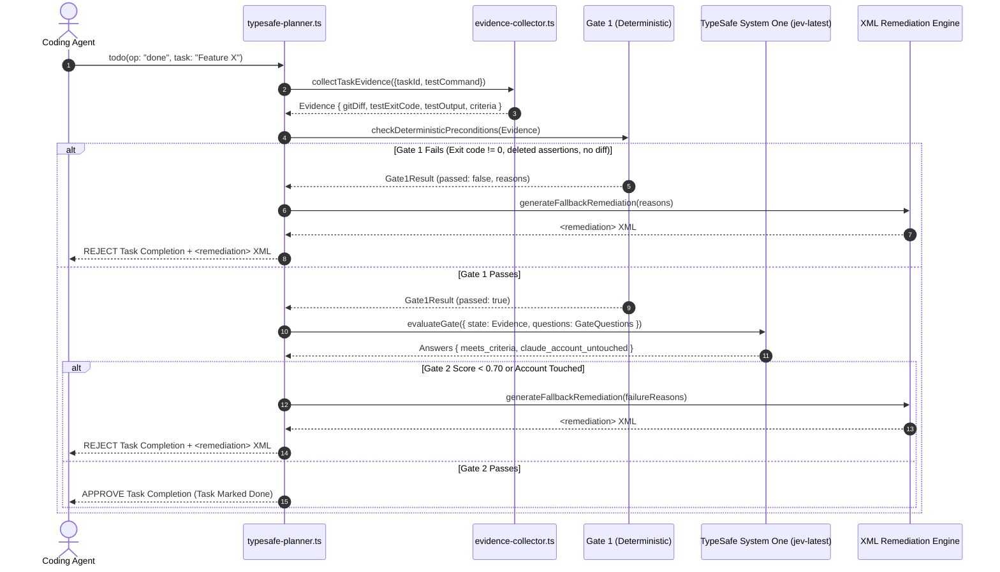
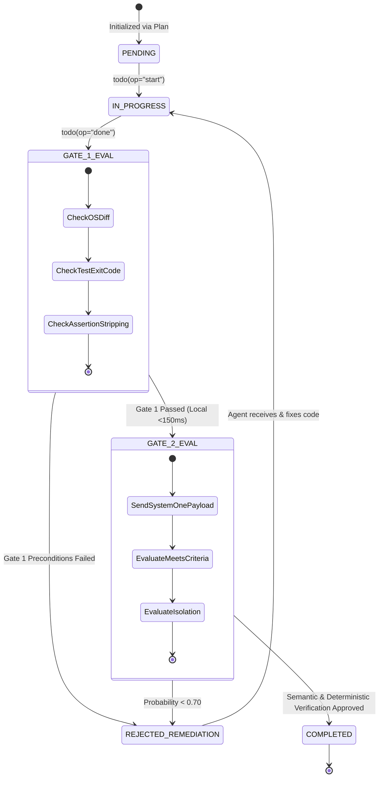

# Data Flow & State Transition Specification

## 1. End-to-End Task Lifecycle Data Flow

The following sequence diagram details the full data flow when an agent requests task completion via `todo(op="done")`:

---

## 2. State Transition Lifecycle

The state of a task progresses through strict finite state machine boundaries:

---

## 3. Failure Ratchet & Circuit Breaker Logic

To prevent infinite hallucination loops:
1. Each task maintains a consecutive failure counter (`failureCount`).
2. If `failureCount >= 3`, the ratchet locks the task into `HARD_STOP`.
3. To recover, the human supervisor must either fix the root cause and provide `resetFailures: true` or manually set `TYPESAFE_ALLOW_MODIFICATION=1`.
