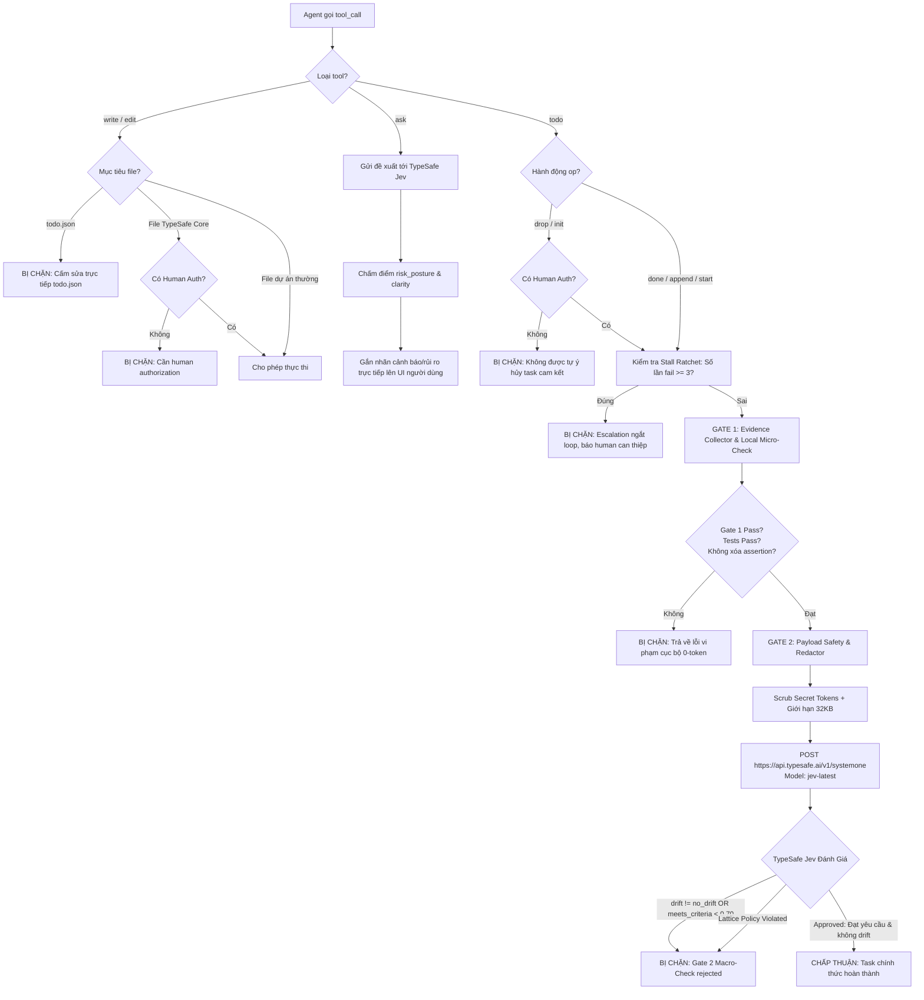
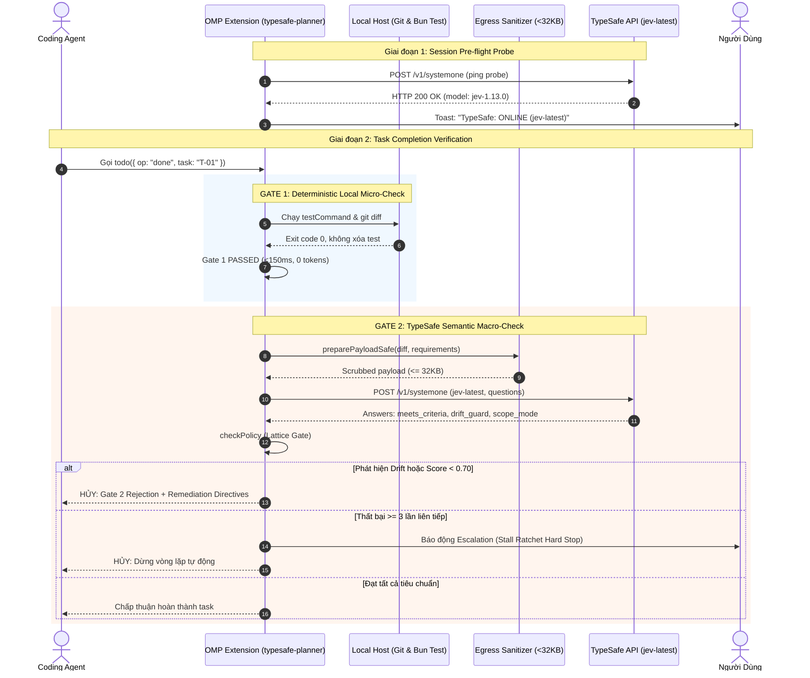

# TypeSafe System One (Jev) Integration Architecture

Tài liệu kỹ thuật tổng hợp toàn diện về kiến trúc điều khiển, cơ chế Dual-Gate verification, quy trình kiểm soát can thiệp (interception), và nguyên nhân xử lý sự cố kết nối TypeSafe System One (`jev-latest`) trong `omp_extension`.

---

## 1. Tổng quan Kiến trúc (Architecture Overview)

`omp_extension` hoạt động như một lớp Middleware kiểm soát thực thi (Execution Guard & Verification Middleware) nằm giữa OMP Host Process và Agent. Extension tích hợp sâu vào lifecycle của Agent thông qua hệ thống event hooks (`session_start`, `before_tool_call`, `tool_call`).

```
                    ┌───────────────────────────┐
                    │      OMP Agent Core       │
                    └─────────────┬─────────────┘
                                  │ Tool Invocations
                                  ▼
┌────────────────────────────────────────────────────────────────────────┐
│                   omp_extension Interception Layer                     │
├───────────────────────┬────────────────────────┬───────────────────────┤
│  1. Resource Shield   │  2. Decision Evaluator │  3. Dual-Gate Engine  │
│     (write / edit)    │        (ask)           │        (todo)         │
│  - Chặn sửa todo.json │  - System One probe    │  - Gate 1: Local 0-tok│
│  - Chặn hạ tầng TypeSafe│- Gắn risk/clarity badge│ - Gate 2: Jev Macro  │
└───────────────────────┴────────────────────────┴───────────────────────┘
                                  │
                                  ▼ Egress Redaction & 32KB Cap
                    ┌───────────────────────────┐
                    │   TypeSafe System One     │
                    │ https://api.typesafe.ai   │
                    │     model: jev-latest     │
                    └───────────────────────────┘
```

---

## 2. Session Pre-Flight Health Probe (`session_start`)

Mỗi khi phiên làm việc mới khởi động, extension thực thi quy trình chẩn đoán tiền trạm (`pre-flight probe` tại dòng 592–643 của `typesafe-planner.ts`):

1. **Kiểm tra môi trường & Quyền dự án**:
   - Xác thực biến môi trường `TYPESAFE_API_KEY` có giá trị không rỗng.
   - Nạp module `~/.claude/hooks/lib/typesafe-enabled-resolver.cjs`.
   - Kiểm tra thư mục dự án hiện tại với cấu hình `.ck.json` (`resolveTypeSafeEnabled(cwd)` phải trả về `enabled: true`).
2. **Ping Probe siêu nhẹ**:
   - Gửi payload JSON `< 200 bytes` trực tiếp đến `https://api.typesafe.ai/v1/systemone` với deadline timeout `3000ms`:
     ```json
     {
       "state": "ping",
       "questions": { "ping": { "type": "noul", "instructions": "ping" } },
       "model": "jev-latest"
     }
     ```
3. **Phát tín hiệu trạng thái**:
   - **HTTP 200 OK**: Kích hoạt thông báo UI `TypeSafe: ONLINE (jev-latest)` và nạp chỉ thị ngầm `PROMPT_INJECTION` vào lượt tiếp theo (`deliverAs: "nextTurn"`).
   - **HTTP 401 / 403**: Báo cảnh báo `TYPESAFE_API_KEY is invalid or expired`.
   - **HTTP 404**: Cảnh báo `models.yml baseUrl does not have an extraneous '/v1' suffix`.
   - **Timeout / Offline**: Cảnh báo `TypeSafe API unreachable`.

---

## 3. Ma trận Can thiệp & Phòng thủ (Interception Matrix)

| Event / Tool | Mục tiêu can thiệp | Hành vi điều khiển | Cơ chế xử lý vi phạm |
|---|---|---|---|
| `write`, `edit` | `todo.json`, `.todo*` | Chặn Agent sửa trực tiếp file trạng thái để tránh gian lận hoàn thành task | Hủy lệnh (`evt.cancel`), gửi thông báo `typesafe-compliance-escalation`, ném ngoại lệ |
| `write`, `edit` | File hạ tầng TypeSafe (`typesafe-planner.ts`, `models.yml`, v.v.) | Ngăn Agent tự ý làm suy yếu hoặc vô hiệu hóa bộ kiểm tra an toàn | Yêu cầu `TYPESAFE_ALLOW_MODIFICATION=1` hoặc `isHuman: true`. Nếu không có, lập tức hủy |
| `ask` | Câu hỏi hoặc quyết định gửi người dùng | Gửi nội dung câu hỏi đến TypeSafe System One để chấm điểm rủi ro (`risk_posture`) và độ rõ ràng (`clarity`) | Tự động chèn badge trực quan `[TypeSafe System One: Risk Score X.XX]` vào UI trước khi con người đọc |
| `todo drop/init`| Danh sách task đã cam kết | Ngăn Agent tự ý hủy task khó hoặc xóa vết | Bắt buộc phải có xác nhận của con người (`isHumanAuthorized`) |
| `todo done` | Đánh dấu hoàn thành task | Kích hoạt hệ thống Dual-Gate Verification | Kiểm tra 2 vòng nghiêm ngặt trước khi cho phép task hoàn thành |

---

## 4. Quy trình Dual-Gate Verification (`todo done`)

### Gate 1: Local Deterministic Micro-Check (Zero-Token, <150ms)
- Thu thập bằng chứng thực tế tại local (`TaskEvidenceCollector`):
  - Chạy `testCommand` thực tế (mặc định: `bun test`).
  - Kiểm tra `git status` và `git diff`.
- Kiểm tra tính toàn vẹn (Anti-Cheating):
  - Kiểm tra xem agent có **xóa assertion (`expect`/`assert`)** hoặc comment-out test suite hay không.
  - Kiểm tra xem working tree có sạch và test có pass với exit code `0` hay không.
- Nếu trượt Gate 1: **Từ chối ngay lập tức tại máy local**, không tốn bất kỳ token mạng nào.

### Gate 2: Semantic Macro-Check (TypeSafe System One - Jev)
- Chuẩn bị dữ liệu an toàn (`preparePayloadSafe`):
  - Lọc toàn bộ Anthropic key (`sk-ant-*`), token và private credentials.
  - Cắt tỉa payload đảm bảo $\le 32\text{ KB}$ để chống context rot.
- Gửi đánh giá ngữ nghĩa tới `https://api.typesafe.ai/v1/systemone` (`model: "jev-latest"`):
  - `architectural_drift`: Kiểm tra có xuất hiện `unapproved_deviation` hoặc `scope_creep` không.
  - `scope_arbiter`: Kiểm tra giữ nguyên phạm vi (`HOLD`) hay tự ý thu hẹp/mở rộng.
  - `meets_criteria`: Điểm đáp ứng tiêu chí cam kết (ngưỡng tối thiểu: $\ge 0.70$).
  - `risk_security_triage`: Đánh giá rủi ro an ninh phát sinh.
- Thực thi **Tighten-Only Lattice Policy**:
  - Kết quả từ TypeSafe chỉ được phép thắt chặt rào cản (nâng mức review, từ chối completion). Tuyệt đối không được phép tự nới lỏng hay bypass test.
- Xử lý khi Gate 2 từ chối:
  - Trả về XML hướng dẫn sửa sai có cấu trúc (`<remediation_protocol>`).
  - Nếu thất bại 3 lần liên tiếp trên cùng một task (**Stall Ratchet**): Lập tức ngắt chu kỳ tự động và chuyển giao cho con người (`escalateToUser`).

---


## 5. Sơ đồ Luồng Xử lý (Flowchart)



## 6. Sơ đồ Luồng Tuần Tự (Sequence Diagram)



---

## 7. Phân tích Nguyên nhân TypeSafe Judge Không Hoạt Động

Nếu kiểm tra thấy TypeSafe Judge không hoạt động hoặc không gửi request tới `api.typesafe.ai`, kiểm tra 4 nguyên nhân gốc rễ sau:

| STT | Nguyên nhân | Cơ chế phát sinh | Biểu hiện & Dấu hiệu nhận biết | Giải pháp khắc phục |
|---|---|---|---|---|
| **1** | **Client-side Validation Chặn Cục Bộ** | `typesafe-api-client.cjs` kiểm tra schema trước khi gửi request mạng. `choice` bắt buộc `criteria` là Dictionary/Map; `score` bắt buộc là Array $\ge 2$ phần tử. | Lỗi `invalid_input: questions.<key>.criteria...`. **Không có HTTP request nào rời khỏi máy**. | Sửa payload truyền vào đúng chuẩn dictionary cho `choice` và array cho `score`. |
| **2** | **Lỗi Lặp `/v1` trong URL (Host Route)** | `~/.omp/agent/models.yml` cấu hình `baseUrl: https://api.typesafe.ai/v1`. OMP transport tự ghép `/v1/systemone` thành `/v1/v1/systemone`. | API trả về **HTTP 404 Not Found** (`{"detail":"Not Found"}`). | Đặt `baseUrl: https://api.typesafe.ai` (bỏ hậu tố `/v1`). |
| **3** | **Stale Cache & Cần Restart OMP** | Node.js cache module và OMP cache provider/model trong SQLite `~/.omp/agent/models.db`. | Sửa file `.yml` hoặc biến môi trường nhưng OMP vẫn dùng thông số cũ. | Khởi động lại (restart) hoàn toàn tiến trình `omp`. |
| **4** | **Test Suite Mặc Định Dùng Mock** | 100% test files trong `tests/*.test.ts` dùng `mockJudge` hoặc mock `fetch`. | Chạy `npm test` không bao giờ thấy request ra mạng hay tăng usage trên dashboard. | Hành vi chuẩn của unit test để đảm bảo tính cô lập và tốc độ chạy. |

---

## 8. Hướng dẫn Vận hành & Phục hồi Sự cố (Runbook)

### Gỡ khóa Stall Ratchet
Khi một task bị fail liên tiếp 3 lần và kích hoạt Stall Ratchet khóa phiên:
```json
{
  "op": "done",
  "task": "Tên_task_bị_khóa",
  "resetFailures": true
}
```

### Bật quyền can thiệp Hạ tầng Bảo vệ
Để chỉnh sửa các file thuộc lá chắn bảo vệ (`typesafe-planner.ts`, `models.yml`):
```bash
# PowerShell
$env:TYPESAFE_ALLOW_MODIFICATION="1"

# Bash / Linux
export TYPESAFE_ALLOW_MODIFICATION=1
```
*Lưu ý: Luôn khởi động lại phiên OMP sau khi gán biến môi trường.*
