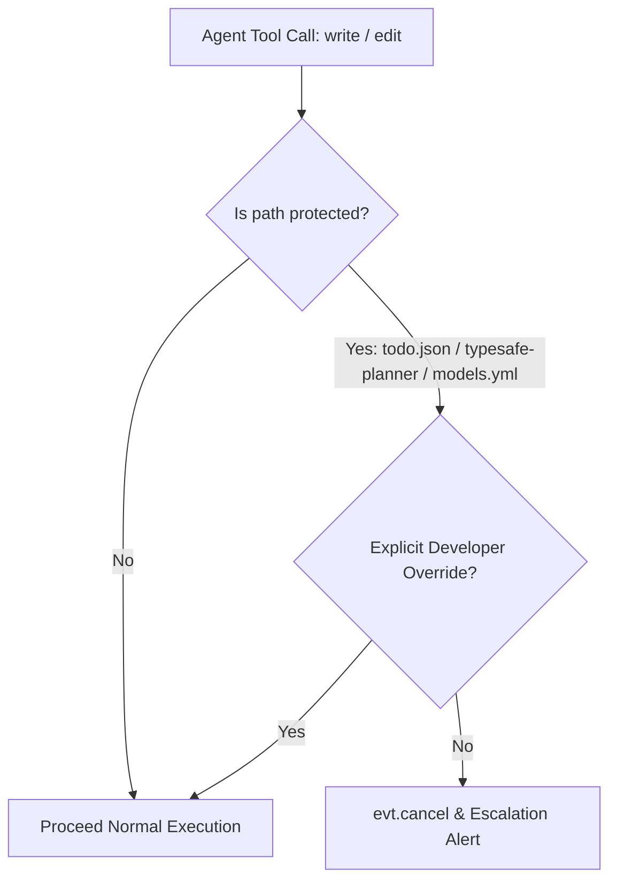

# Phase 1: File and Code Integrity Shield

## Overview
Protects core TypeSafe infrastructure files (`typesafe-planner.ts`, `~/.omp/agent/models.yml`, and shared kit modules) from unintended or adversarial modification by autonomous AI tools (`write`, `edit`), eliminating configuration drift and judge corruption.

## Requirements
- **Functional Requirements:**
  - Intercept tool calls targeting protected files (`typesafe-planner.ts`, `models.yml`, `typesafe-policy-client.cjs`, `typesafe-redact.cjs`, `typesafe-enabled-resolver.cjs`).
  - Immediately cancel tool execution and raise a structured `typesafe-integrity-violation` escalation event to `pi.sendMessage`.
  - Provide an explicit override mechanism via `allowJudgeModification: true` parameter and operator confirmation prompt. <!-- Updated: Validation Session 1 -->
- **Non-Functional Requirements:**
  - Interception overhead $< 1\text{ms}$.
  - Fail-closed: if the path normalizer fails to parse the destination, default to blocking if the target string matches protected filenames.

## Architecture
The interception hook in `typesafe-planner.ts` (`handleTodoInterception`) is expanded into a generalized **Resource Integrity Guard**:

## Related Code Files
- Create: `tests/integrity-shield.test.ts` (TDD tests)
- Modify: `typesafe-planner.ts` (Resource Integrity Guard implementation)

## Implementation Steps (TDD Cadence)
1. **Red Stage:**
   - Create `tests/integrity-shield.test.ts`.
   - Write tests simulating `write` and `edit` tool calls targeting:
     - `typesafe-planner.ts`
     - `.omp/agent/models.yml`
     - `~/.claude/mcp/typesafe/typesafe-policy-client.cjs`
   - Assert that tool execution throws `IntegrityViolationError` and emits `typesafe-integrity-violation` message.
   - Run `bun test tests/integrity-shield.test.ts` and confirm failure.
2. **Green Stage:**
   - Update `typesafe-planner.ts` `handleTodoInterception` to define `PROTECTED_INTEGRITY_PATTERNS`.
   - Add normalized path matching for workspace-relative and home-directory relative targets.
   - Emit user escalation message with exact guidance on how to bypass safely if authorized.
3. **Refactor Stage:**
   - Ensure clean path normalization across both POSIX and Windows path separators (`\` and `/`).

## Success Criteria
- [x] Attempting to modify `typesafe-planner.ts` via `write`/`edit` is blocked deterministically.
- [x] Attempting to modify `models.yml` via `write`/`edit` is blocked deterministically.
- [x] Unit tests in `tests/typesafe-integrity.test.ts` pass with 100% coverage.

## Risk Assessment
- **Risk:** Developer is legitimately trying to update the planner extension and gets blocked.
- **Mitigation:** Include clear instructions in the rejection message on how to bypass with parameter flag or direct terminal editing.
