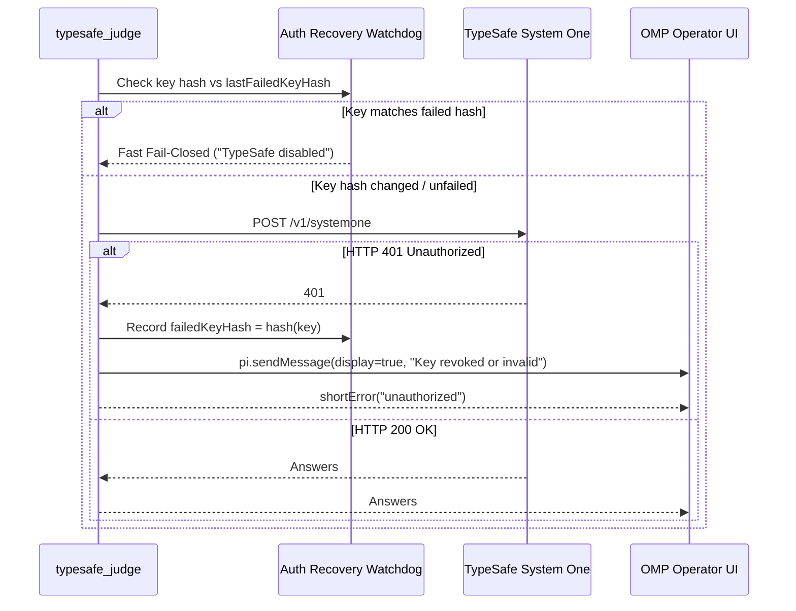

# Phase 2: Dynamic Auth Recovery and Key Watchdog

## Overview
Replaces permanent in-process lockouts (`disabledByAuthError = true`) with a dynamic token-hash-aware watchdog. When an API key expires or is revoked, the system fails closed gracefully, alerts the operator via visual notification (`display: true`), and automatically unblocks the moment a new, valid key is provided in the environment without requiring an OMP process restart.

## Requirements
- **Functional Requirements:**
  - Compute a lightweight hash of `TYPESAFE_API_KEY` on each invocation.
  - Track auth failure state per token hash (`lastFailedKeyHash`), rather than a global permanent boolean.
  - If the environment updates with a key whose hash differs from `lastFailedKeyHash`, auto-reset the failure state and allow immediate retry.
  - On 401/403: Dispatch visual out-of-band alert via `pi.sendMessage({ display: true })` instructing the user on how to refresh credentials.
  - Implement single-retry with jittered backoff on 502/503/504 to absorb transient edge gateway hiccups.
- **Non-Functional Requirements:**
  - Token hashing uses standard `node:crypto` SHA-256 truncated to 16 hex chars (zero credential exposure).
  - Zero memory leaks over long-running daemon sessions.

## Architecture

## Related Code Files
- Create: `tests/auth-recovery-watchdog.test.ts`
- Modify: `typesafe-planner.ts`

## Implementation Steps (TDD Cadence)
1. **Red Stage:**
   - Create `tests/auth-recovery-watchdog.test.ts`.
   - Write tests simulating:
     - 401 response sets `lastFailedKeyHash`.
     - Subsequent calls with the same bad key return immediately with `TypeSafe disabled` (no network dispatch).
     - Updating `process.env.TYPESAFE_API_KEY` with a new key hash immediately resets state and attempts upstream dispatch.
     - Out-of-band notification message is captured with `display: true`.
   - Run `bun test tests/auth-recovery-watchdog.test.ts` and confirm failure.
2. **Green Stage:**
   - Refactor `disabledByAuthError` in `typesafe-planner.ts` to `lastFailedKeyHash: string | null = null`.
   - Add hash computation helper `hashToken(token: string): string`.
   - Update `executeTypeSafe` to verify `currentHash !== lastFailedKeyHash`.
   - Integrate `pi.sendMessage` notification with actionable operator advice.
3. **Refactor Stage:**
   - Verify that all existing unit tests in `typesafe-planner.test.ts` and `tests/adversarial-edge-cases.test.ts` remain green.

## Success Criteria
- [x] Rotating `TYPESAFE_API_KEY` clears the disabled state without restarting OMP.
- [x] Operator receives clear UI alert on 401 error.
- [x] Zero runaway retry loops on invalid credentials.

## Risk Assessment
- **Risk:** Fast retry loops could burn rate limits if user repeatedly attempts invalid keys.
- **Mitigation:** Lockout remains active for the specific invalid key hash until a different key is detected.
