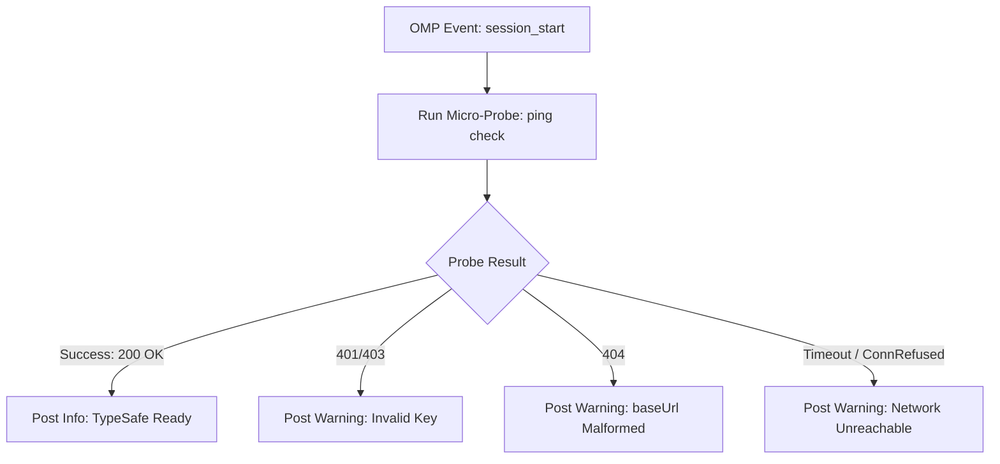

# Phase 3: Session Pre-Flight Health Probe

## Overview
Implements a non-blocking, event-driven pre-flight diagnostic probe executed at `session_start` and on major review boundaries. Surfaces actionable visual notifications to the operator rather than allowing silent degradation or mysterious mid-turn failures.

## Requirements
- **Functional Requirements:**
  - On `session_start`: Dispatch a minimal, ultra-low-token probe ($<100$ bytes state, single binary question) to verify network, auth, and routing health.
  - If probe succeeds: Post subtle status confirmation: `TypeSafe: ONLINE (jev-latest)`. <!-- Updated: Validation Session 1 -->
  - If probe fails: Post an immediate, high-visibility warning (`display: true`) categorizing the exact root cause:
    - `HTTP 401/403`: "TYPESAFE_API_KEY is invalid or expired. Check your environment configuration."
    - `HTTP 404`: "TypeSafe endpoint returned 404 Not Found. Verify models.yml baseUrl does not have an extraneous '/v1' suffix."
    - `Network Error / Timeout`: "TypeSafe API unreachable. Check internet connection or proxy settings."
    - `Resolver Denied`: "Workspace is not opted in via .claude/.ck.json."
- **Non-Functional Requirements:**
  - Non-blocking: Probe must complete or time out within 3000ms; failures must never halt OMP startup.
  - Minimal token consumption: Payload size $< 200$ bytes, costing fractions of a cent per session start.

## Architecture

## Related Code Files
- Create: `tests/health-watchdog.test.ts`
- Modify: `typesafe-planner.ts`

## Implementation Steps (TDD Cadence)
1. **Red Stage:**
   - Create `tests/health-watchdog.test.ts`.
   - Write tests for:
     - Successful probe on `session_start` triggers success status message.
     - 401 probe failure emits authentication alert with `display: true`.
     - 404 probe failure emits routing alert pointing to `models.yml` with `display: true`.
     - Abort timeout at 3000ms handles hung network without process crash.
   - Run `bun test tests/health-watchdog.test.ts` and assert failures.
2. **Green Stage:**
   - Implement `runPreFlightProbe(apiKey, projectDir, pi)` in `typesafe-planner.ts`.
   - Wire `runPreFlightProbe` into the `pi.on("session_start")` handler.
   - Format specific diagnostics messages per HTTP status code and error class.
3. **Refactor Stage:**
   - Cache successful probe status per session to avoid re-triggering probes unnecessarily on secondary turn events.

## Success Criteria
- [x] Starting a session with a healthy key displays `TypeSafe: ONLINE (jev-latest)`.
- [x] Starting a session with an invalid key immediately warns operator with remedial instructions.
- [x] Network failures abort within 3s without blocking the main chat session.

## Risk Assessment
- **Risk:** Slow internet on startup causes startup lag.
- **Mitigation:** Run probe asynchronously in the background (`deliverAs: "nextTurn"`) with a strict 3-second abort deadline.
