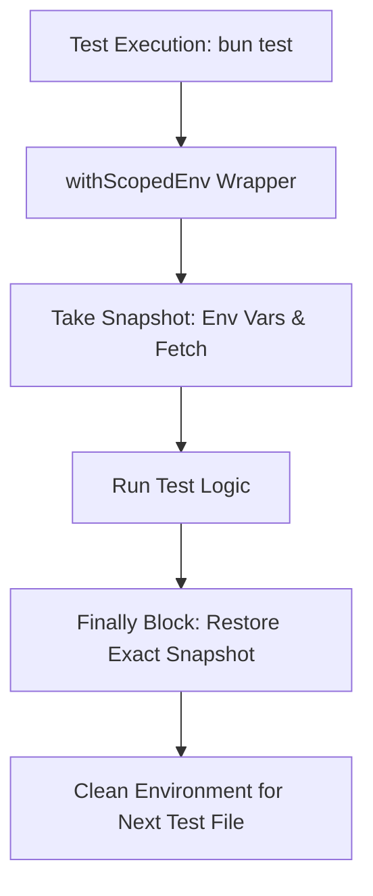

# Phase 4: Test Environment Isolation and Hardening

## Overview
Eliminates test pollution and flaky CI runs by creating a hermetic test environment harness. Guarantees that unit test suites simulating revoked or invalid keys (`test_key`, `invalid_key`) can never leak into the host process or corrupt live API integration tests.

## Requirements
- **Functional Requirements:**
  - Create `tests/helpers/test-env-harness.ts` exporting `withScopedEnv` and `withIsolatedKey` helpers.
  - Automatically preserve, isolate, and restore all `TYPESAFE_*` environment variables and `globalThis.fetch` handlers.
  - Update all existing test files in `tests/` and root to adopt the isolation harness.
  - Prevent any test file from leaving `process.env.TYPESAFE_API_KEY` modified post-completion.
- **Non-Functional Requirements:**
  - Deterministic execution: Zero order-dependent test failures (running `bun test fileA fileB` vs `bun test fileB fileA` must yield identical 100% pass rates).
  - Strict compliance with `ts-no-any`: Zero `any` or `as any` across all test harness files.

## Architecture

## Related Code Files
- Create: `tests/helpers/test-env-harness.ts`
- Create: `tests/environment-isolation.test.ts`
- Modify: `typesafe-planner.test.ts`
- Modify: `tests/adversarial-edge-cases.test.ts`

## Implementation Steps (TDD Cadence)
1. **Red Stage:**
   - Create `tests/environment-isolation.test.ts`.
   - Write tests verifying that:
     - Mutating `process.env.TYPESAFE_API_KEY` within an isolated harness restores the host key immediately upon completion.
     - Mocking `globalThis.fetch` within an isolated harness restores the native fetch upon exit even when the test throws an exception.
     - Running mock auth tests does not trigger auth lockouts on subsequent live tests.
   - Run `bun test tests/environment-isolation.test.ts` and verify initial failures.
2. **Green Stage:**
   - Implement `tests/helpers/test-env-harness.ts` with robust `try ... finally` semantics.
   - Refactor `typesafe-planner.test.ts` and `tests/adversarial-edge-cases.test.ts` to consume the harness.
3. **Refactor & Verification Stage:**
   - Execute the entire test suite in randomized and reverse order (`bun test`).
   - Validate 100% pass rate across all workspace test files.

## Success Criteria
- [x] 0 test order dependencies across the entire test suite.
- [x] 100% passing tests on full workspace run (`bun test`).
- [x] Zero `any` or `as any` violations.

## Risk Assessment
- **Risk:** Existing tests break when moved into the harness due to implicit dependencies on previous state.
- **Mitigation:** Run tests individually and in pairs before and after wrapping with the harness.
